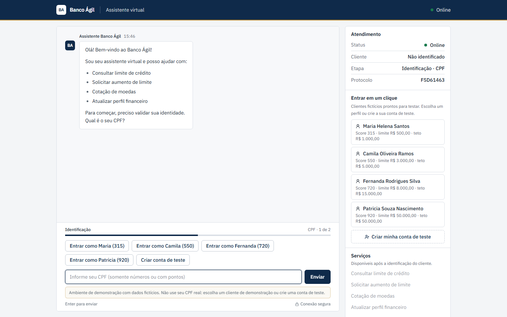
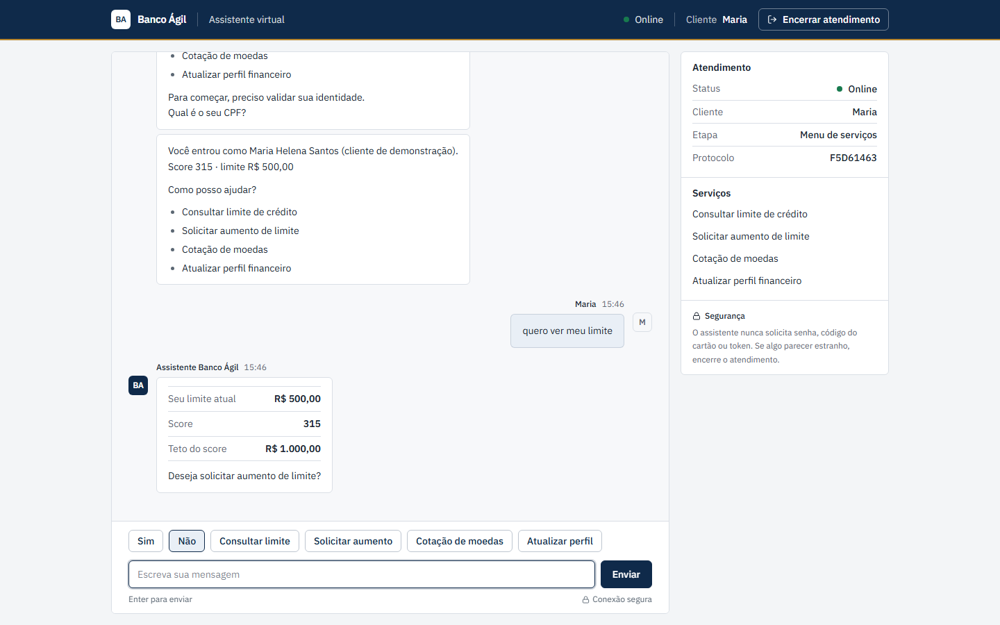
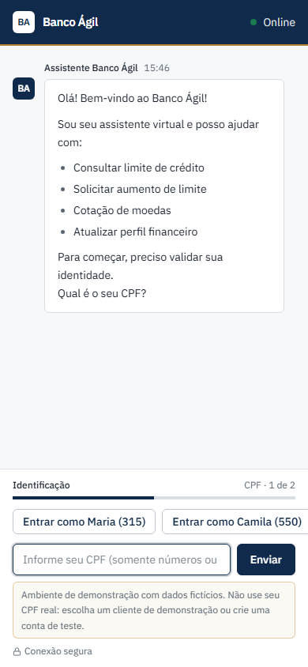
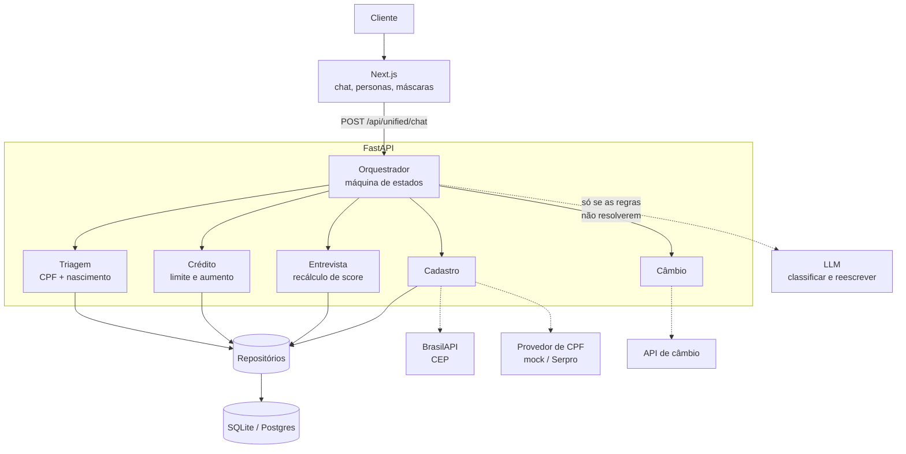

# Banco Ágil — Assistente Bancário Conversacional

[](https://github.com/PatrickEN-dev/IA-Agent-Tech-For-Humans-Back-end/actions/workflows/ci.yml)


Assistente virtual de um banco: autentica o cliente, consulta e altera limite de crédito,
cota moedas e conduz uma entrevista financeira que recalcula o score. A conversa é
conduzida por uma máquina de estados determinística; o modelo de linguagem entra só onde
agrega — e nunca decide um valor.

**API:** FastAPI · SQLAlchemy 2 (async) · **Front:** Next.js 14 · TypeScript · Tailwind

| | |
|---|---|
| Back-end | este repositório |
| Front-end | [`IA-Agent-Tech-For-Humans-Front-end`](https://github.com/PatrickEN-dev/IA-Agent-Tech-For-Humans-Front-end) |

---

## Teste em um minuto

Você **não precisa** conhecer nenhum CPF para usar o sistema. Há três caminhos:

1. **Entrar em um clique** — a tela inicial lista clientes de demonstração com score e
   limite visíveis. Um clique autentica.
2. **Criar sua conta de teste** — escreva `criar conta` no chat. O assistente pede nome e
   data de nascimento, e gera um CPF válido para você se quiser (`gera um pra mim`).
   O CEP é opcional e preenche cidade e estado via BrasilAPI.
3. **Usar um CPF da base** — a tabela de [dados de teste](#dados-de-teste) abaixo.

Depois de entrar, experimente:

| Escreva | O que acontece |
|---|---|
| `meu limite` | Limite concedido, score e o teto que o score sustenta |
| `quero aumentar para 15 mil` | Aprovado, análise manual ou negado — conforme o score |
| `quero 1 milhão` | Negado, com oferta de entrevista para reavaliar o score |
| `ganho 8 mil e sou CLT` | Entra na entrevista e recalcula score e limite |
| `quanto está o dólar?` | Cotação real, com taxa de contingência se a API cair |
| `cancelar` | Sai de qualquer fluxo e volta ao menu |



<details>
<summary>Mais capturas (celular e consulta de limite)</summary>




</details>

---

## Arquitetura



### Por que híbrido, e não só LLM

Regras de palavra-chave classificam a intenção primeiro, em 0 ms e sem rede. O modelo só
é chamado quando elas se abstêm. Isso não é opinião — é medido:

```
$ python scripts/eval_intents.py

Regras (0 ms, sem rede)
  acurácia:   91.2%  (93/102)
  cobertura:  87.3%  (abstenções: 13)

  por rótulo:
     confirm  12/12  100%      goodbye    10/10  100%
     credit_limit  12/12  100% greeting   10/10  100%
     exchange_rate 12/12  100% interview  10/10  100%
     reject   10/10  100%      request_increase 12/12 100%
   ! off_topic  0/8    0%      other       5/6    83%
```

**87% das mensagens nunca chegam ao modelo.** O único rótulo que as regras não cobrem é
`off_topic` — elas se abstêm de propósito, e é exatamente esse resto que justifica o LLM.

O conjunto de avaliação está em [`evals/intents.jsonl`](evals/intents.jsonl) (102 frases
rotuladas à mão). O CI trava a acurácia em 90%, então uma palavra-chave nova não derruba o
classificador em silêncio. Essa avaliação encontrou quatro bugs reais na primeira
execução — entre eles, "boa tarde" sendo interpretado como *aceitar a oferta pendente*.

### O LLM nunca decide um número

Valores, decisões de crédito e scores saem do código. O modelo recebe um texto já pronto
e só o reescreve. Como a mensagem do cliente entra nesse prompt, a humanização é um vetor
de *prompt injection* — e o guarda contra isso é determinístico, não uma instrução no
prompt:

```python
# src/services/llm_service.py
if humanized and self._preserves_facts(technical_response, humanized):
    return humanized
# senão, usa o template
```

`_preserves_facts` extrai valores em R$, datas, códigos de moeda e números da resposta
técnica e exige que todos sobrevivam à reescrita — e que nenhum valor monetário novo
apareça. Um modelo totalmente comprometido não consegue dizer ao cliente que o limite
dele é R$ 1.000.000,00. Isso é testado em
[`tests/test_prompt_injection.py`](tests/test_prompt_injection.py), sem chamar LLM nenhum.

---

## Regras de crédito

Três coisas diferentes, que o sistema não confunde:

| Conceito | O que é |
|---|---|
| **Limite atual** | O que foi concedido ao cliente, persistido e alterável |
| **Teto do score** | O máximo que a faixa de score sustenta (`score_limite.csv`) |
| **Valor pedido** | O que o cliente pediu agora |

E três desfechos, que **todos acontecem de verdade**:

| Pedido | Score | Resultado |
|---|---|---|
| Até o teto | qualquer | **Aprovado** — o limite muda na hora |
| Entre o teto e 1,5× o teto | ≥ 600 | **Análise manual** — registrado, limite inalterado |
| Acima disso | qualquer | **Negado** — com oferta de entrevista |

A entrevista combina histórico e declaração com pesos fixos (`0,6 × atual + 0,4 ×
entrevista`) em vez de média cega, e a resposta diz quais fatores pesaram mais. Cada
mudança de score grava um evento em `score_events`, na mesma transação — decisão de
crédito que o banco não consegue justificar depois não serve.

Não existe campo "disponível": o MVP não tem extrato de compras, e inventar um percentual
seria mentir para o cliente.

---

## Sobre a consulta de CPF

Não existe API pública e gratuita que devolva nome e data de nascimento a partir de um CPF
no Brasil. As fontes legítimas (Serpro Consulta CPF / Datavalid, bureaus como BigDataCorp
ou Idwall) são pagas e exigem contrato com CNPJ. As "gratuitas" que aparecem em buscas são
bases vazadas, e usá-las viola a LGPD.

A solução aqui é a mesma que um time de produto adotaria antes de fechar o contrato: uma
porta (`CpfVerificationProvider`) com dois adaptadores.

```
CPF_PROVIDER=mock     # padrão: valida dígitos verificadores, offline, determinístico
CPF_PROVIDER=serpro   # adaptador Serpro, escrito contra o contrato publicado
```

O `mock` nunca afirma que um CPF existe: ele responde "sintaticamente válido, situação
cadastral desconhecida", que é exatamente o que o sistema sabe sem consultar a Receita.
Trocar pelo adaptador real é uma variável de ambiente, e qualquer falha de rede ou
autorização degrada para o local em vez de derrubar o cadastro. Ver
[`src/services/cpf_provider.py`](src/services/cpf_provider.py).

**O que é integração externa de verdade neste projeto:** BrasilAPI para CEP (pública,
gratuita, sem chave, sem dado pessoal — preenche cidade e estado no cadastro) e a API de
câmbio, com cache e taxas de contingência quando ela cai.

---

## Rodando

```bash
python -m venv venv
.\venv\Scripts\activate          # Windows
# source venv/bin/activate       # Linux/Mac

pip install -r requirements-dev.txt
cp .env.example .env             # os padrões funcionam sem nenhuma chave de API

python scripts/seed.py --reset   # cria o banco a partir dos CSVs
python app.py                    # http://localhost:8000  (Swagger em /docs)
```

O `lifespan` já roda o seed no boot, então o passo manual só é necessário para inspecionar
o banco antes de subir. Sem `OPENAI_API_KEY` o sistema funciona inteiro por regras e
templates — nada fica indisponível.

### Front-end

```bash
git clone https://github.com/PatrickEN-dev/IA-Agent-Tech-For-Humans-Front-end
cd IA-Agent-Tech-For-Humans-Front-end
npm install
BACKEND_URL=http://localhost:8000 npm run dev    # http://localhost:3000
```

> `BACKEND_URL` é lido em **tempo de build**: o Next resolve os `rewrites()` e os grava no
> `routes-manifest.json`. Mudar a variável e reiniciar o `npm run start` não tem efeito —
> é preciso rebuildar.

### Docker

```bash
docker compose up -d      # http://localhost:8000
```

---

## Dados de teste

Os CPFs abaixo são sintéticos: passam no algoritmo de dígitos verificadores e não
pertencem a ninguém. A senha é a data de nascimento.

| CPF | Nome | Nascimento | Score | Limite | Demonstra |
|---|---|---|---|---|---|
| 529.982.247-25 | Maria Helena Santos | 15/05/1990 | 315 | R$ 500,00 | Aumentos grandes negados, leva à entrevista |
| 450.742.250-78 | Camila Oliveira Ramos | 09/02/1987 | 550 | R$ 3.000,00 | Aumento modesto aprovado |
| 526.859.556-31 | Fernanda Rodrigues Silva | 18/04/1988 | 720 | R$ 8.000,00 | Acima do teto vai para análise manual |
| 443.631.859-10 | Patricia Souza Nascimento | 14/06/1976 | 920 | R$ 50.000,00 | Já no topo da tabela |

Lista completa em [`src/data/clientes.csv`](src/data/clientes.csv). Os quatro acima são os
que aparecem como personas na interface — escolhidos pelo seed por faixa de score, não
codificados. Os testes usam uma base própria e isolada (`tests/conftest.py`).

---

## Endpoints

| Método | Rota | Descrição |
|---|---|---|
| `GET` | `/health` | Status, versão, modo demo e contadores de uso do LLM |
| `POST` | `/api/unified/init` | Abre uma sessão de chat |
| `POST` | `/api/unified/chat` | Envia uma mensagem ao orquestrador |
| `GET` | `/api/unified/session/{id}` | Retoma a conversa após um F5 (404 se expirou) |
| `GET` | `/api/demo/personas` | Clientes de demonstração (404 fora do modo demo) |
| `POST` | `/api/unified/demo-login` | Entra como uma persona, em uma chamada |
| `POST` | `/api/signup` | Cria uma conta de teste |
| `GET` | `/api/signup/suggested-cpf` | Gera um CPF válido e livre |
| `GET` | `/api/address/{cep}` | Consulta de CEP (BrasilAPI) |
| `POST` | `/api/triage/authenticate` | Autenticação direta (retorna JWT) |
| `GET` | `/api/credit/limit` | Consulta limite (JWT) |
| `POST` | `/api/credit/request_increase` | Solicita aumento (JWT) |
| `POST` | `/api/interview/submit` | Envia a entrevista financeira (JWT) |
| `GET` | `/api/exchange?from=USD&to=BRL` | Cotação (JWT) |

O front usa apenas `/unified/*`, `/demo/*` e `/signup*`; os demais expõem os agentes
individualmente e estão documentados no Swagger.

---

## Testes

```bash
pytest                                    # 276 testes, sem nenhuma chamada de LLM
pytest --cov=src --cov-report=html        # cobertura (84%)
python scripts/eval_intents.py            # acurácia do classificador
python scripts/eval_intents.py --llm      # compara regras, LLM e híbrido
python scripts/fix_client_cpfs.py --check # valida os CPFs da base
```

A suíte cobre, entre outras coisas: o algoritmo de CPF contra o CSV de produção, os três
desfechos de crédito, o cadastro por endpoint e por conversa, o bloqueio por CPF entre
sessões, a retomada de sessão e o guarda contra prompt injection.

No front-end: `npm test` (Vitest, 23 testes) e `npm run test:e2e` (Playwright, 5 testes
com a API mockada no browser — não dependem deste repositório).

---

## Segurança

- **CPF + data de nascimento não é autenticação forte.** É a restrição do desafio.
  Mitigado por: três tentativas por CPF (não por sessão — abrir aba nova não zera o
  contador), bloqueio com janela de expiração, rate limit por IP e dados fictícios.
- **Rate limit** em `/unified/chat` (60/min), `/triage/authenticate` (10/min) e `/signup`
  (5/min), desligável por configuração.
- **JWT** de 15 minutos para os endpoints diretos; a sessão de chat vive no servidor.
- **CPF mascarado em todo log** (`529.***.***-25`).
- **Cabeçalhos de segurança** no front (`X-Frame-Options`, `X-Content-Type-Options`,
  `Referrer-Policy`, `Permissions-Policy`).
- **Prompt injection** barrado por verificação determinística, não por instrução no prompt.

---

## Observabilidade

- `X-Request-ID` por requisição (gerado se ausente), propagado a todos os logs do turno
  via `contextvars` — é como se reconstrói uma conversa específica no meio do log.
- Logs em JSON com `JSON_LOGS=true`, filtráveis por `request_id`.
- `/health` expõe `turns_total`, `llm_turns_total` e `llm_turn_ratio`: a fração de turnos
  que custou uma chamada ao modelo, medida em produção.

---

## Persistência

Os CSVs do desafio deixaram de ser o banco e passaram a ser o **seed**. O que roda é
SQLAlchemy 2 async.

| Ambiente | `DATABASE_URL` | Reset no boot |
|---|---|---|
| Local | `sqlite+aiosqlite:///./data/banco_agil.db` | opcional |
| Demonstração (Render) | idem | **sim** — o disco do plano gratuito é efêmero |
| Produção | `postgresql+asyncpg://…` | não |

No plano gratuito do Render o disco volta ao estado do deploy a cada reinício. Para uma
demonstração isso é vantagem: `DEMO_RESET_ON_START=true` garante que todo visitante
encontra a mesma base limpa. Para produção, a resposta é Postgres externo — e as duas
configurações usam o mesmo código, porque os agentes falam com repositórios, não com ORM.

Tabelas: `clients`, `score_limits`, `limit_requests` (trilha de auditoria de cada decisão,
com o motivo) e `score_events` (histórico de score com a origem da mudança).

---

## Variáveis de ambiente

As principais; a lista completa e comentada está em [`.env.example`](.env.example).

| Variável | Descrição | Padrão |
|---|---|---|
| `DATABASE_URL` | SQLite local ou Postgres | `sqlite+aiosqlite:///./data/banco_agil.db` |
| `DEMO_RESET_ON_START` | Recria o banco pelo seed a cada boot | `true` |
| `DEMO_MODE` | Liga personas e auto-cadastro | `true` |
| `SIGNUP_ENABLED` | Permite criar conta de teste | `true` |
| `CPF_PROVIDER` | `mock` ou `serpro` | `mock` |
| `USE_LANGCHAIN` | Ativa classificação e humanização por LLM | `false` |
| `LLM_PROVIDER` / `OPENAI_API_KEY` | Provedor e chave | `openai` / — |
| `RATE_LIMIT_ENABLED` | Limite de requisições por IP | `true` |
| `JSON_LOGS` | Log estruturado em uma linha por evento | `false` |
| `MAX_AUTH_ATTEMPTS` / `AUTH_LOCKOUT_MINUTES` | Tentativas e janela de bloqueio por CPF | `3` / `15` |
| `JWT_SECRET_KEY` | Avisa no log se ficar no padrão | `dev-secret-key…` |

---

## Estrutura

```
├── app.py                      # Ponto de entrada (uvicorn)
├── evals/intents.jsonl         # 102 frases rotuladas para avaliar o classificador
├── scripts/
│   ├── seed.py                 # Carrega o banco a partir dos CSVs
│   ├── eval_intents.py         # Acurácia de regras, LLM e híbrido
│   ├── fix_client_cpfs.py      # Corrige/valida os CPFs da base (idempotente)
│   └── smoke_integration.py    # Smoke manual contra um servidor rodando
├── src/
│   ├── main.py                 # App, lifespan (seed), request id, rate limit, /health
│   ├── config.py               # Settings (pydantic-settings)
│   ├── api/routes.py           # Endpoints; instancia e injeta agentes e serviços
│   ├── agents/
│   │   ├── orchestrator.py     # Máquina de estados da conversa
│   │   ├── triagem.py          # Autenticação com limite de tentativas por CPF
│   │   ├── credito.py          # Limite e decisão de aumento
│   │   ├── entrevista.py       # Recálculo de score
│   │   └── cambio.py           # Cotações
│   ├── db/                     # Modelos, repositórios, sessão e seed
│   ├── services/               # auth, cadastro, personas, CPF, CEP, LLM, score,
│   │                           # rate limit, telemetria, tentativas de autenticação
│   ├── models/                 # Domínio (dataclasses) e schemas (Pydantic)
│   ├── utils/                  # CPF, normalização, extratores, formatação, log, erros
│   └── data/                   # CSVs de seed
└── tests/                      # 276 testes
```

---

## Documentação

- [Guia para avaliadores](README-RECRUTADOR.md)
- [Documentação técnica](docs/DOCUMENTACAO-TECNICA.md)
- [Arquitetura híbrida](docs/arquitetura-hibrida-v2.md)
- [Otimização de tokens](docs/otimizacao-tokens.md)
- [Plano de evolução](docs/PLANO-EVOLUCAO.md)

## Licença

MIT
